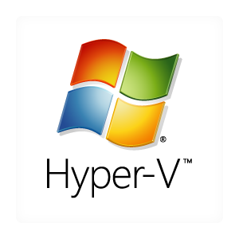

<h1>Virtualization</a></h1>

<h2>Virtualization Platforms</h2>
Hey, starting a homelab with a particular Virtualization platform was the initail plan. But then, had to experiment with all the available platforms. VMWare was the Requirement of the course as the labs were based on the platform. It was provide as a latest licenced copy with full functionality. but the fact that it will expire after the course was the reason to try Virtual box from Oracle. Then there was proxmox another open source and seemed to be popular among homelab enthusiasts. Each has its own pros and cons. So I had to experiment to understand each platform and its features and the way the network settings have to be configured, also the settings for each VM, and its storage. At this point it was only underastandable that I had to know how to migrate Vm's between platforms. so below I have a brief description of each platform and a screenshot of my VM's. By the way I use both Virtual Box and proxmox. finally I used Hyper-V to run windows environoments. Microsoft has a complete lab setup which lets you play around with a fully setup domain controller and clients already joined to it. Ok then thats for the intro, below you can get a feel of the lab I setup for my understanding. Hope you can have you own and enjoy the journey to understand managing a network and its elements and also manage and harden security control. My ultimate goal is to understand the analysis of logs and monitoring softwares and create my own dashboards to give me the best insight and help me in provide monitoring and mitigation solutions.  

 
***The Virtual Box lab*** Environment is set up with three different topologies. Environment is set up with three different topologies.Environment is set up with three different topologies. One is based on the topology and older machines used in the Holmesglen Netlab activities. the second lab is b ased on a SIEM Security Information and Event Management perspective. This lab was built to simulate a SOC analyst environment to conduct all sorts of log monitoring and analysing various attacks which is carried out by Kali Linux from an internal network and outside the network. the third lab was a openvpn lab, built with openvpn.  
 
***The Proxmox lab*** Proxmox VE is a comprehensive virtualization platform ideal for home use. It provides a user-friendly web interface for managing virtual machines and containers, simplifying the setup and administration process. With support for both KVM and LXC, users can create flexible virtual environments tailored to their needs. Proxmox VE offers features like clustering and backup, ensuring reliability and data protection for home-based projects. Whether experimenting with different operating systems or hosting personal services, Proxmox VE offers a robust solution for home virtualization needs. Environment is built to understand the baremetal server environment and various linux based installations. It is a general lab environment with a SOC analyst perspective and to understand the Proxmox platform.  
 
***The Hyper-V Lab*** Hyper-V is Microsoft's native hypervisor for Windows, offering virtualization capabilities suitable for home users. It comes integrated with Windows 10 Pro and higher editions, providing a seamless experience for creating and managing virtual machines. With Hyper-V, users can easily set up and run multiple operating systems on a single physical machine. Its intuitive management interface allows for straightforward configuration of virtual machines and networking settings. Whether testing software, running legacy applications, or experimenting with different environments, Hyper-V offers a convenient and efficient solution for home virtualization needs. Environment is built again to understand the platform and aslo to experiment with various windows scenarios. I have used this lab most extensively to setup and manage Domain Controller, Active Directory services, IIS(Internt Information Services) Web server, and Microsoft Exchange server. windows 11 and Office 365 Deployment Lab kit is a wonderful lab to learn a lot on deployment and configuration services.  
  <b></b>   
  - <b>***The Virtual Box Holmesglen Netlab Setup 1*** .</b> 
  
  <b></b> 
  - <b>***The Virtual Box SIEM Setup 2*** .</b> 
  
  <b></b> 
  - <b>***The Virtual Box Open Vpn Setup 3*** .</b> 
  
  <b></b>  
   <b>Proxmox Lab setup</b> 

  <b></b>  
   <b>Hyper-V Lab setup</b> 

  <b></b> 

